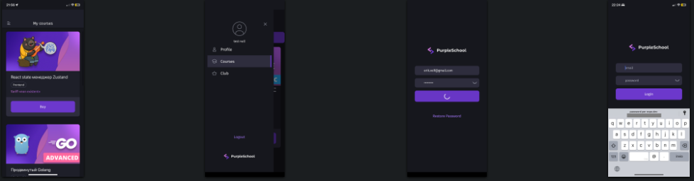
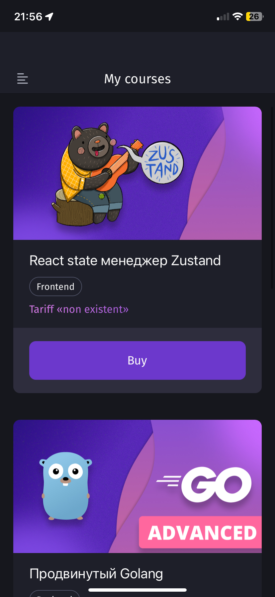
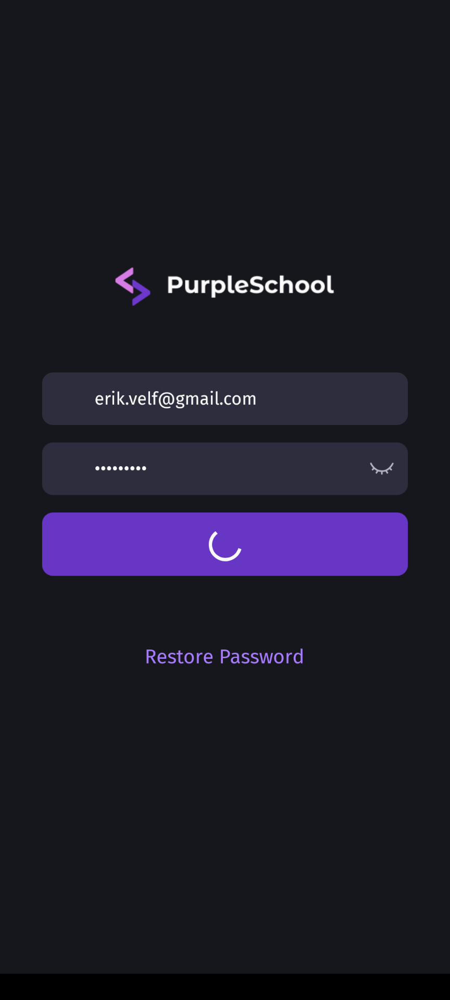
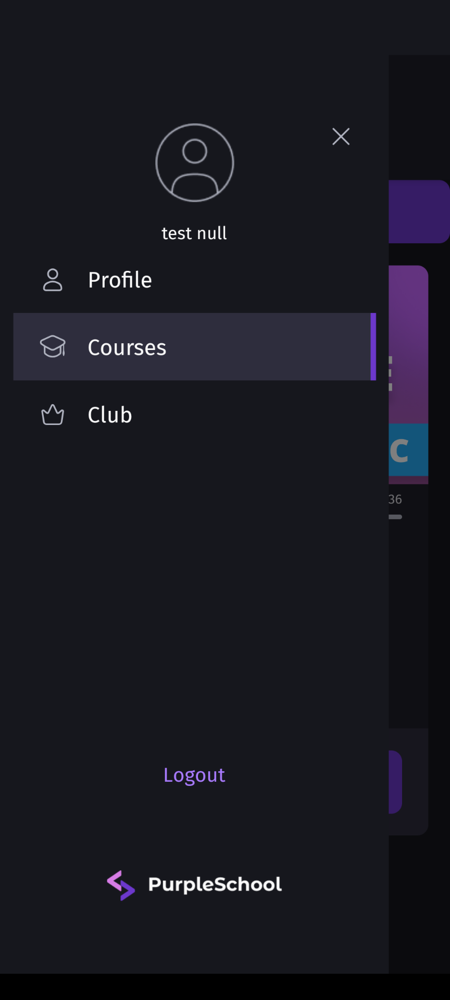
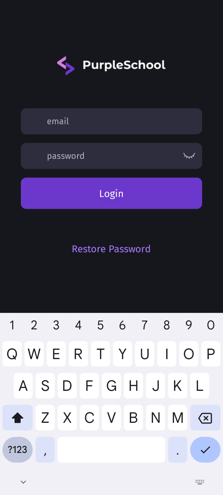

# Mobile frontend for online school 'purpleschool.ru' (learning project)

 **For more images scroll to the end**

The app is created with Expo and it's architecture is based on
[Feature Sliced Design](https://feature-sliced.design/docs/get-started/overview).
The app has the following features:

- [x] Splash screen
- [x] Project-wide theme
- [x] Logging in to the platform
- [x] Setup state managment with Jotai
- [x] Setup routing
- [x] Login page
- [x] Token-based authorization
- [x] Loading data (course information) from the API
- [x] Scheduling local notifications
- [ ] ... to be continued

 
 

